<p align="center">
  
  
  
  
  
  
  
</p>

<h1 align="center">🧠 Max Super Prompt — The Jarvis Killer</h1>
<h3 align="center">Modular Multi-Mode Senior Engineer Persona for Any LLM</h3>

<p align="center">
  <em>"A full-stack company in one body — modular, adaptive, token-efficient."</em>
</p>

<p align="center">
  <strong>Open Source</strong> · <strong>Model Agnostic</strong> · <strong>Platform Agnostic</strong> · <strong>100% Prompt</strong>
</p>

---

## 📦 What Is Max Super Prompt?

A **universal persona skill** that transforms any LLM into a **multi-mode Senior Engineer** — CTO, Architect, Developer, Teacher & DevOps in one. Features automatic mode switching, a reasoning protocol, and production-quality output standards.

### Architectural Highlights

| Feature | Description |
|---|---|
| 🧩 **Modular Architecture** | 15 independent reference modules + compressed assembler — load what you need |
| 🔄 **Decision Engine** | Keyword scoring + priority-based mode selection — zero ambiguity |
| 📦 **Dynamic Capability Loading** | 6 domain modules load only when relevant (Backend, Frontend, DevOps, AI/ML, Mobile, Desktop) |
| 🧩 **4 Context Layers** | System → Project → Memory → Task — clean separation of concerns |
| 🔌 **Tool Registry** | 14 operations × 5 platforms with permissions, fallback chains & compatibility matrix |
| 🪶 **Dual Version** | Full (~6KB) for Claude/ChatGPT/Hermes + Lite (~2.9KB) for Edge Gallery/Gemma |
| 📜 **10 Golden Rules** | Simplicity, Root Cause, Verify Before Done, Security First & more |
| 🎯 **Scored Mode Selection** | Weighted keyword matrix + context cues + base energy — deterministic scoring |
| 💰 **Token-Budget Layer** | Module registry with token costs + context-dependent greedy fit algorithm |

---

## 📂 Repository Structure

```
max-skill/
├── README.md                          ← This file
├── _config.yml                        ← GitHub Pages config
├── index.html                         ← Landing page (SEO)
├── .nojekyll
│
├── max-super-prompt/
│   ├── SKILL.md                       ← 🏆 PRIMARY: Full version (~6KB, 15 modules)
│   │                                      For: Claude, ChatGPT, Hermes, OpenRouter, API
│   │
│   ├── lite/
│   │   └── SKILL.md                   ← 🪶 SECONDARY: Lite version (~2.9KB)
│   │                                      For: Edge Gallery, Gemma, resource-constrained
│   │
│   ├── references/                    ← 🧩 15 reference modules
│   │   ├── core-persona.md            ← Identity + Deep Context Protocol
│   │   ├── core-rules.md              ← 10 Golden Rules with examples
│   │   ├── core-modes.md              ← Full Decision Engine + output formats
│   │   ├── core-response.md           ← Response template per mode
│   │   ├── core-context-layers.md     ← 4-layer context separation
│   │   ├── core-tool-abstraction.md   ← Unified Tool Registry (14 ops × 5 platforms)
│   │   ├── capabilities-backend.md    ← Backend/API expertise
│   │   ├── capabilities-frontend.md   ← Frontend/UI expertise
│   │   ├── capabilities-devops.md     ← DevOps/Cloud expertise
│   │   ├── capabilities-ai-ml.md      ← AI/ML & Data Science (NEW)
│   │   ├── capabilities-mobile.md     ← Mobile Development (NEW)
│   │   ├── capabilities-desktop.md    ← Desktop Applications (NEW)
│   │   ├── arabic-dialect-system.md   ← 5-dialect Arabic support
│   │   ├── CHANGELOG.md              ← Version history
│   │   ├── ROADMAP.md                ← Vision & planned features
│   │   └── edge-gallery-hosting.md    ← GH Pages deployment guide
│   │
│   └── scripts/                      ← 🛠️ JS tools (Edge Gallery)
│       ├── memory.html               ← Persistent KV store + AES vault
│       ├── search.html               ← Web search via CORS proxy
│       ├── vision.html               ← Image color/texture analysis
│       ├── voice.html                ← Text-to-Speech
│       └── dashboard.html            ← Stats & memory tree viewer
│
└── wiki/                             ← 📚 Full documentation
    ├── Home.md
    ├── Installation.md
    ├── Modes.md
    ├── JS-Tools.md
    ├── Arabic-Dialects.md
    └── Security.md
```

---

## 🔧 Quick Start

### 🏆 Claude Code / OpenCode / Codex (Full — Recommended)
```bash
curl -s https://jenzo0.github.io/max-skill/max-super-prompt/SKILL.md > /tmp/max.md
claude --prompt "$(cat /tmp/max.md)"
```

### 🤖 Hermes Agent (Full)
```bash
git clone https://github.com/Jenzo0/max-skill.git
cp -r max-skill/max-super-prompt ~/AppData/Local/hermes/skills/persona/
# Then: skill_view(name='max-super-prompt')
```

### 🌐 ChatGPT / OpenRouter / Any API (Full)
Paste `https://raw.githubusercontent.com/Jenzo0/max-skill/main/max-super-prompt/SKILL.md` into the System Prompt field.

### 📱 Google AI Edge Gallery / Gemma (Lite)
**URL import:**
```
https://jenzo0.github.io/max-skill/max-super-prompt/lite/
```

**Or download:** `max-super-prompt/lite/SKILL.md` → Edge Gallery → (+) → Import local skill.

---

## 🚀 Mode Reference

| You Say | Mode | Max Does |
|---|---|---|
| "Design an e-commerce system" | 📐 **Architect** | Architecture doc + trade-offs + phased plan |
| "Build a FastAPI auth API" | 💻 **Code** | Full API with JWT, Pydantic, Swagger docs |
| "Explain async/await like I'm 5" | 🎓 **Teacher** | Simple analogy + technical breakdown |
| "Fix this 500 error" | ⚡ **Fast Solve** | Root cause → immediate fix → prevention |
| "Just give me the Dockerfile" | 🤫 **Absolute** | Code only, no explanation |
| "Run this script on loop" | 🤖 **Agent** | Multi-step with tool abstraction |
| "Deploy to K8s with CI/CD" | 🐳 **DevOps** | IaC + pipeline config + monitoring |
| "Train a LoRA on Gemma-4" | 🧠 **AI/ML** | Training script + config + evaluation |
| "Build a React Native app" | 📱 **Mobile** | Cross-platform with Expo + native modules |
| "Create a Tauri desktop app" | 💻 **Desktop** | Rust backend + web frontend + packaging |

---

## 🧠 Architecture

### System Flow

```mermaid
flowchart TB
    INPUT["👤 User Input"]
    DECISION["🔀 Decision Engine\nScored Mode Selection"]
    
    subgraph MODES["Mode Scoring Matrix"]
        ARCH["📐 Architect"]
        CODE["💻 Code"]
        TEACH["🎓 Teacher"]
        FAST["⚡ Fast Solve"]
        ABS["🤫 Absolute"]
        AGENT["🤖 Agent"]
        DEVOPS["🐳 DevOps"]
    end
    
    BUDGET["💰 Token-Budget Layer\nGreedy Module Fit"]
    
    subgraph MODULES["Module Registry"]
        CAP_B["capabilities-backend<br/>~380 tokens"]
        CAP_F["capabilities-frontend<br/>~380 tokens"]
        CAP_ML["capabilities-ai-ml<br/>~420 tokens"]
        CAP_MO["capabilities-mobile<br/>~400 tokens"]
        CAP_D["capabilities-desktop<br/>~400 tokens"]
        CAP_DO["capabilities-devops<br/>~420 tokens"]
        CTX["core-context-layers<br/>~300 tokens"]
        TOOL["core-tool-abstraction<br/>~480 tokens"]
    end
    
    LAYERS["🧩 Context Layers\nL1 System → L2 Project → L3 Memory → L4 Task"]
    OUTPUT["📝 Response Engine\nTemplate + Mode-Specific Format"]
    
    INPUT --> DECISION
    DECISION -->|Score each mode| MODES
    MODES -->|Highest score| BUDGET
    BUDGET -->|Fit by context window| MODULES
    MODULES --> LAYERS
    LAYERS --> OUTPUT
    OUTPUT -->|"[mode: X | alt: Y | score: Z]"| RESULT["🏁 Final Output"]
```



### Context Override Priority
```
┌──────────────────────────────────┐
│  L4: TASK (current message)      │ ← Overrides everything
├──────────────────────────────────┤
│  L3: MEMORY (user preferences)   │ ← Cross-session
├──────────────────────────────────┤
│  L2: PROJECT (current context)   │ ← Per-project
├──────────────────────────────────┤
│  L1: SYSTEM (persona + rules)    │ ← Always active
└──────────────────────────────────┘
```

### Tool Resolution
```
Operation → Detect Platform → Check Availability → Execute → Fallback if Failed
```

### Load Algorithm (Token-Budget Fit)
```
1. Score each module by relevance (0–5) based on active mode + user query
2. Sort by relevance × (1 — token cost / total budget)
3. Greedy fit: pick highest-scoring modules until budget full
4. Fallback: if total avail tokens < module budget → skip all, use Lite core
```

---

## 🪶 Version Comparison

| Feature | Primary: Full (~6KB) | Secondary: Lite (~2.9KB) |
|---|---|---|
| **Target** | Claude, ChatGPT, Hermes, API, OpenRouter | Edge Gallery, Gemma, resource-constrained |
| **Modes** | 7 (Decision Engine + priority scoring) | 7 (trigger-based) |
| **Rules** | 10 Golden Rules (full table) | 5 core rules |
| **Capability Domains** | 6 (Backend · Frontend · DevOps · AI/ML · Mobile · Desktop) | — |
| **Context Layers** | ✅ 4-layer separation | — |
| **Tool Registry** | ✅ 14 ops × 5 platforms + fallbacks | ✅ Basic tool mapping |
| **Dynamic Loading** | ✅ Capability modules per mode | — |
| **Reference Modules** | 15 | — |
| **NEVER Directives** | 1 (safe for target platforms) | 0 (zero, for Gemma safety) |
| **Import URL** | `max-super-prompt/` | `max-super-prompt/lite/` |

---

## 📖 Demo Gallery

See the 7-mode Decision Engine in action:

| Query | Mode Selected | Score | Output Style |
|---|---|---|---|
| *"Design a microservices architecture for a fintech app"* | 📐 **Architect** | 8 (keywords: design×2, system×2, scale×1 → ×1.0) | Trade-off doc with C4 diagrams |
| *"Fix this MySQL deadlock error"* | ⚡ **Fast Solve** | 6 (keywords: fix×2, error×2, wrong×1 → ×1.2) | Root cause → `SHOW ENGINE INNODB STATUS` → fix |
| *"Just write the Dockerfile, no talk"* | 🤫 **Absolute** | 7 (keywords: just code×2, direct×1, only code×1 → ×1.5) | Raw Dockerfile, zero commentary |
| *"Explain Kubernetes ingress in simple terms"* | 🎓 **Teacher** | 5 (keywords: explain×2, how does×1, understand×1 → ×0.8) | Analogy + technical breakdown |
| *"Deploy a 3-tier app to AWS EKS with Terraform"* | 🐳 **DevOps** | 9 (keywords: deploy×2, k8s×2, cloud×1, terraform×2 → ×1.0) | Full IaC + pipeline |

> 💡 **Pro tip**: Append `[mode: absolute]` in your query to force Absolute mode — overrides scoring entirely.
> 
> 📹 *[Screen recording demo coming soon]*

---

## 🤝 Contributing

See **[CONTRIBUTING.md](CONTRIBUTING.md)** for full guide — module templates, PR workflow, token-budget checks, and style guide.

Quick start:
1. Fork the repo
2. Improve modules under `references/` — each is a standalone `.md` file
3. Run the token-budget check (instructions in CONTRIBUTING.md)
4. Test with Lite version for Edge Gallery safety
5. Submit a PR

---

## 📄 License

Licensed under the **[MIT License](./LICENSE)** — Free to use, modify, share.

---

<p align="center">
  Built with ❤️ by <a href="https://github.com/Jenzo0">Jenzo Sky</a>
  <br>
  <strong>⭐ Star if useful! ⭐</strong>
  <br><br>
  <em>"Max — Senior Engineer, not just AI."</em>
  <br><br>
  <strong>💪 Ready when you are! ✨</strong>
</p>
